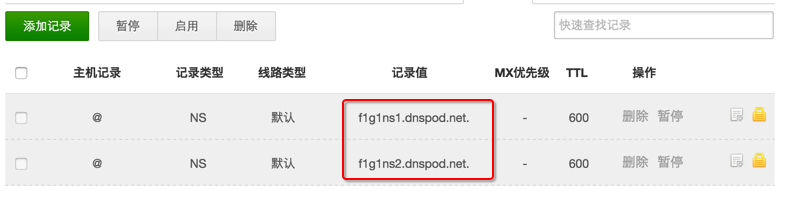
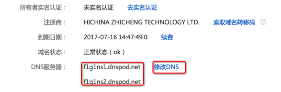

生命不息，折腾不止。此次系列主要记录怎么将自己的域名解析到服务器上。当然，首先，你需要一个域名。这里吐槽下阿里云，我是因为买域名送了买服务器的优惠券才选择购买的阿里云，到头来我要将自己的域名解析到阿里云的时候，阿里云又需要备案域名才可以解析，我购买的服务器的期限是1个月，估计备案域名的时间也需要这么长时间，意味着备案成功后，我的服务器也到期了。那我还解析个毛啊，果断退了阿里云服务器，购买了香港的vps。

解析域名，当然首推[Dnspod](https://www.dnspod.cn/). 注册也挺方便，直接使用QQ扫描登陆授权就可以了。

首先需要添加一条域名记录，默认新添加一条记录后是这个样子：

需要把红线框住的两条NS记录提交到域名提供商那里。因为我的域名是从万网买的，所以要登陆阿里云，点击“修改DNS”，将DNS记录修改为Dnspod提供的那两条记录

至此，以后所有域名的操作都可以在Dnspod上搞定了，跟阿里云没有关系了。
